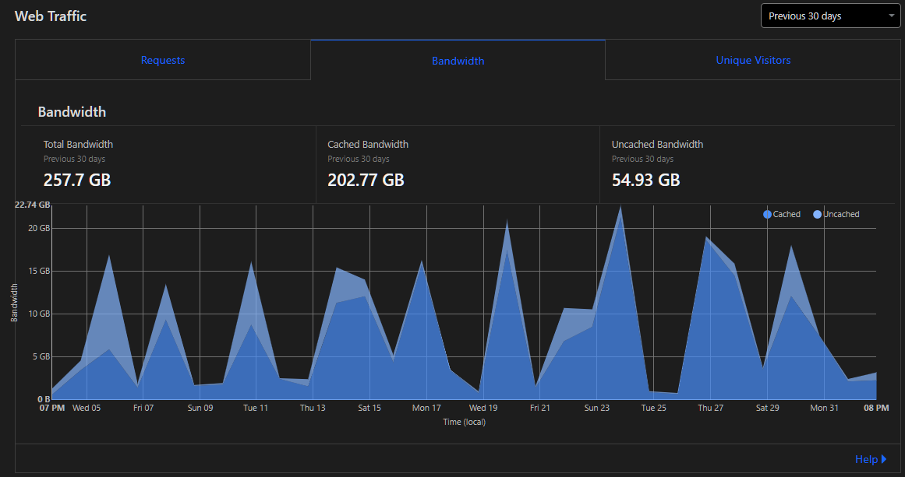

## Tag Creation
Images are saved as lossless webp for their competitive lossless size savings and very good lossy size savings. While lossless does not compare with lossy compression, I wanted to maintain a high quality source image if I needed to reference or re-extract subtags from. Tags are always exported at a 1:1 W:H ratio, with some tags with 1px of difference

Videos are saved as VP9 webm files with a 10MB/s VBR. This usually ends up instead at 1MB/s (cq35) with the goal length of 10s per tag, with leeway above and below those values. Videos are also exported at 1:1 ratio, usually at 720x720px, 1080x1080px, 2160x2160px

### Codec/ Bitrate selection
After running a string of encoding settings (2025-04-10), 10k VBR seems to have a step up in distributing bitrate through the vile

## Access
### B2
B2 + CF Worker proxy (Free bandwith, filename required)  
`https://b2-tags.feederbox826.workers.dev/filename`  
`https://b2.tags.feederbox.cc/filename`  
Tags are backed up to b2 daily with a proxied cf worker serving assets with free bandwidth

### Caddy
Caddy `/by-name` (10T bandwidth, filename not required)  
image only (falls back to stil screenshot) `https://tags.feederbox.cc/by-name/img/tagname`  
any (video or image) `https://tags.feederbox.cc/by-name/tagname`

## Naming
### Folder format
There are 2 subfolders
- lowres
  - older low-resolution images (<720p) that have been replaced with newer high-res images but kept around for achival
- alt
  - alternative tag videos/images that 
### File format
File names ideally follow stashdb naming, but are slightly transformed to prevent url clashes.

- replace "." with ""
- replace ":" with "-"
- replace " ", "/" and "\\" with "_"

### Quality Folders
There are 3 folders generated by thumbsup and one manually with [webp-watcher](https://github.com/feederbox826/webp-watcher)

- original - full resolution
- webp - webps at -q 80 (90% space savings, barely any quality reduction)
- large - resized to 1000x1000
- medium - resized to 512x512
- thumb - resized to 256x256

```js
const cleanFileName = (filename) =>
  filename
    .trim()
    .replace(/\./g, "")
    .replace(/\:/g, "-")
    .replace(/ |\/|\\/g, "_")
    .replace(/%u(....)/g, (m,p)=>String.fromCharCode("0x"+p))
    .replace(/%(..)/g, (m,p)=>String.fromCharCode("0x"+p))
```

Images are always .webp or .svg (for some meta tags)  
Videos are always .webm

## Caching
Because of the (relatively) static nature of the tags, caching is unfortunately unavoidable. The only analytics I run are from those proxied through CloudFlare. From Mar 4 to Apr 3, 2025 this is the bandwidth graph:  This makes caching an unfortunate reality as it saves me over 200GB of bandwidth. The entire tag repo is ~7GB, which equals ~36.7 people downloading the entire collection of tags. Caddy is configured for 7 days Cache-Control with etags.

## Backend
1. Tags downloaded with [stash-tag-sync](https://github.com/feederbox826/stash-tag-sync)
2. Gallery created with [thumbsup](https://github.com/feederbox826/thumbsup)